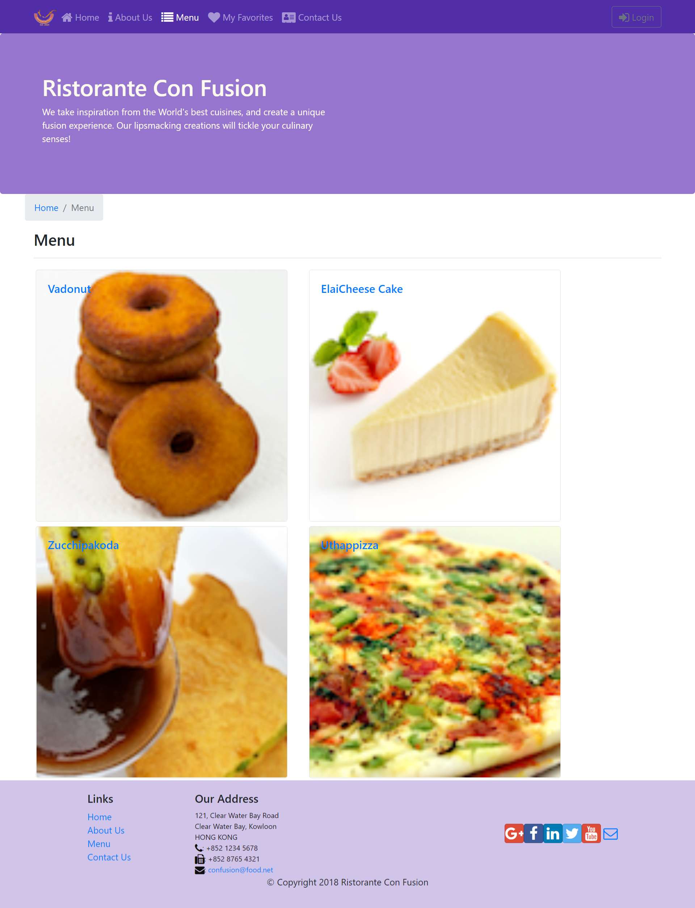
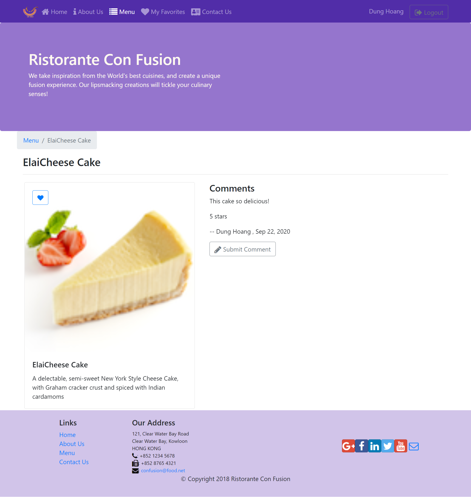

# CONFUSION

## What is Confusion?
Confusion is a website of the restaurant which will show the dishes, details of dishes and all the information of the restaurant. This website helps users can login, see all dishes, comment on dishes and mark favorites dishes easily.  

The website was completely written in React framework together with Redux.

## App’s Feature:
* User friendly interface
* User can see all the dishes of menu, write the comments and mark the favorites dishes.
* User can leave the information for contacting.

## Technology Stack
* JavaScript
* React Redux
* CSS
