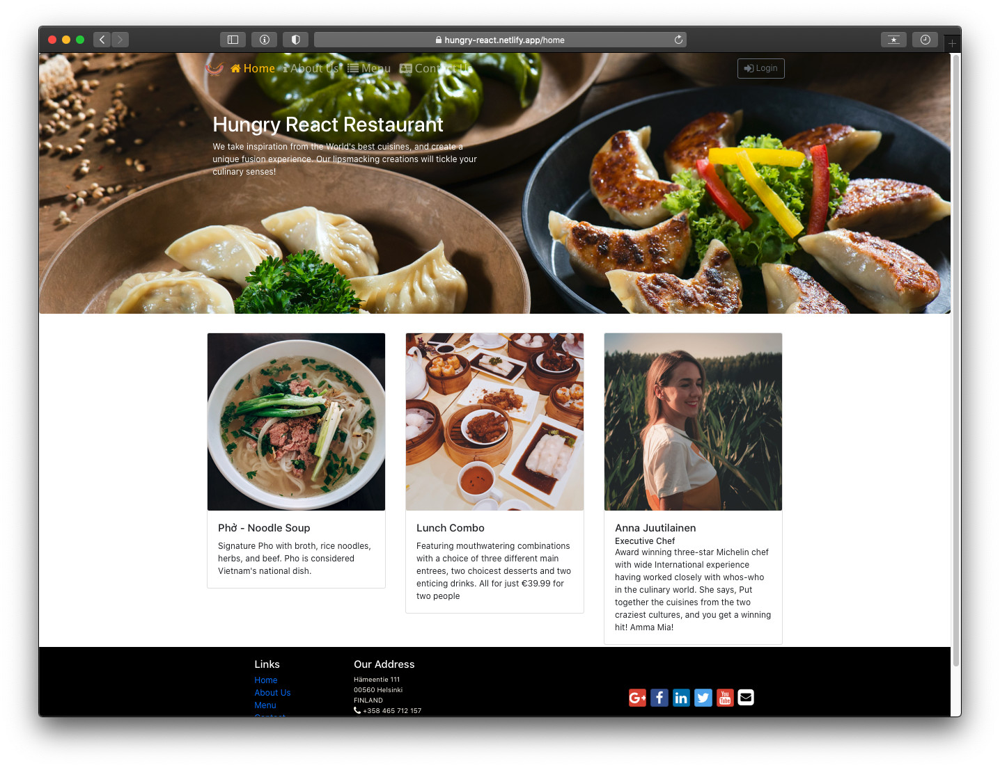
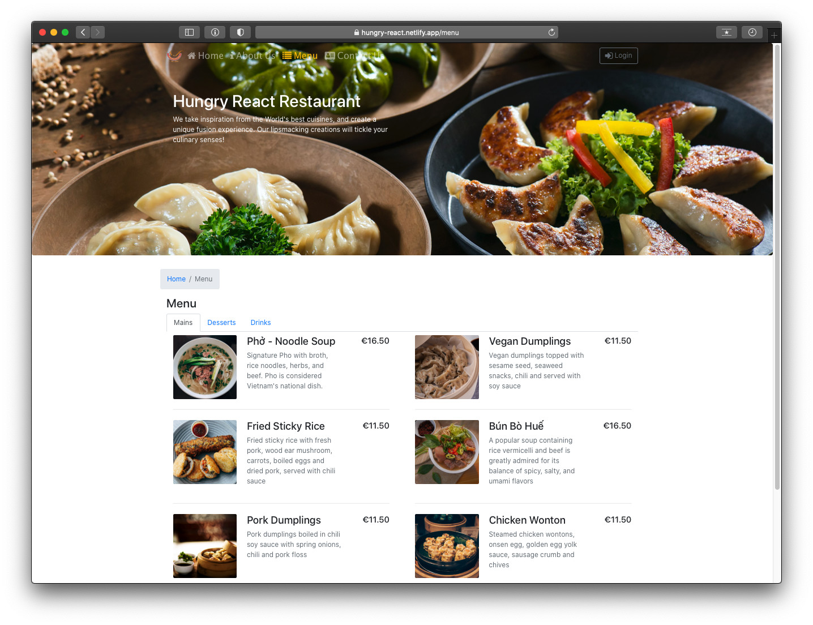

# HUNGRY-REACT
## You can access to the website [here](https://hungry-react.netlify.app/)

## What is Hungry-React?
Hungry-React is a website of the restaurant which will show the dishes, details of dishes and all the information of the restaurant. This website helps users can login, see all dishes, and write comment on dishes easily. 

The website was completely written in React framework together with Redux.

## App’s Feature:
* User friendly interface
* User can see all the dishes of menu and write the comments on dishes.
* User can leave the information for contacting.

## Technology Stack
* JavaScript
* React Redux
* CSS
